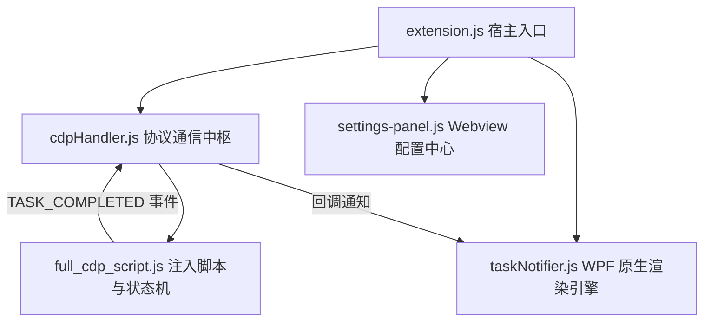

# Auto-Agent-AntiGravity 架构规则、工程边界与开发注意事项

## 1. 项目定位与核心使命
Auto-Agent-AntiGravity 是专为 Antigravity / Cursor / VS Code 生态打造的高性能 AI 辅助与自动化控制插件。
核心职责：
- **零干预自动化执行**：通过 CDP (Chrome DevTools Protocol) 协议注入，实时感知并自动确认/执行安全命令与文件应用。
- **高保真状态感知**：通过 DOM 状态机监听 AI 生成开始/结束，精准判定任务完成状态。
- **独立硬件级通知**：基于 Windows WPF / DirectX 构建高性能置顶弹窗，展示 2:1 黄金比例艺术卡片或毛玻璃 UI。

---

## 2. 核心架构与模块职责划分

1. **`extension.js`**：
   - VS Code 插件主生命周期控制器。
   - 注册状态栏、快捷命令、配置监听以及全局事件总线。
2. **`main_scripts/cdp-handler.js`**：
   - 扫描 `9000~9030` 端口的 CDP 调试实例。
   - 管理 WebSocket 连接、脚本注入以及宿主与 Webview 间双向事件中继。
3. **`main_scripts/full_cdp_script.js`**：
   - 注入到 IDE 内部的智能主循环 (`unifiedLoop`)。
   - **双轨状态机 (`isWorking` 与 `hasDoneIndicator`)**：
     - **Antigravity 主判据**：输入按钮出现 `input-send-button-stop-tooltip` 表示模型工作中；切回 `input-send-button-send-tooltip` 表示模型完成。这里的 Send/Stop 是模型输入按钮状态，不是 IDE 进程启动/关闭。
     - **旧界面回退判据**：仅当专用 Send/Stop tooltip 不存在时，才检测 Cancel/Stop、旋转动画、Copy 图标和发送就绪态。
     - **边沿触发机制 (Edge-Triggered Flip-Flop)**：仅当从“工作中 (`wasWorking=true`)”转移为“完成态 (`!isWorking && hasDoneIndicator`)”瞬间派发单次 `TASK_COMPLETED` 事件，发完立即清零 `wasWorking=false`，彻底杜绝多轮对话历史旧图标误报与假阴性漏报。
   - **性能与 Shadow DOM 穿透**：通过 `getSearchRoots` 缓存检索根节点（Iframe + ShadowRoot），使用 `findAny/querySelector` 短路完成态查询，并把多个按钮选择器合并为单次 DOM 扫描。禁止在没有基准数据时声称固定 CPU 占用或零 GC。
4. **`main_scripts/taskNotifier.js`**：
   - 通过 `powershell.exe` 动态运行由 `taskNotifier.js` 生成的独立 WPF 窗体。
   - 严格保证 **2:1 黄金比例 (396x206)**、16px 圆角裁剪、发光边框与动态随机图片池。
5. **`main_scripts/settings-panel.js`**：
   - 现代化毛玻璃配置 Webview，支持频率调节、黑名单命令配置与通知风格切换。

---

## 3. 核心设计约束与工程边界 (Boundaries & Constraints)

### 3.1 WPF 与 XAML 渲染边界
- **XAML 属性与子标签互斥**：在 `<Border>` 等元素中，如果使用了 `<Border.Background><ImageBrush .../></Border.Background>` 子标签，**严禁在标签内同时声明 `Background="..."` 属性**，否则将导致 `XamlParseException`。
- **路径规范**：XAML 中引用的本地文件路径必须统一转为正斜杠格式（`replace(/\\/g, '/')`），避免反斜杠在不同编码与 PowerShell 作用域中发生双重转义解析异常。
- **图片尺寸严格锁定 2:1**：`media/` 下的所有海报图片分辨率均为 `2880x1440`，弹窗容器内部尺寸必须与之一致（如 `380x190`），严禁破坏比例导致被强制裁切。
- **进程用完即焚**：WPF 弹窗在用户点击或超时（8s）后必须调用 `$window.Close()`，确保 PowerShell 进程彻底退出，不留任何孤儿进程。

### 3.2 CDP 注入与状态机边界
- **前后台免打扰与完成通知策略**：
  - **前台防打扰**：当 `vscode.window.state.focused === true`（用户在前台操作 IDE）时，严禁弹出任务完成桌面通知，避免干扰前台打字与浏览。
  - **后台精准通知**：只有模型输入按钮完成 `Stop -> Send` 边沿、没有待处理 Accept/Allow 动作、通知已启用且 IDE 失焦时才能弹出。当前实现没有“静默 3500ms”条件，不得在文档或修改中虚构该门禁。
  - **MCP 严格隔离**：MCP、终端和工具加载器不得写入模型 `working` 状态；Antigravity 专用 Send/Stop tooltip 存在时，只信任该输入按钮，不得用全页面 spinner 触发通知状态机。
  - **单次事件保证**：页面端使用 `wasWorking` 边沿并在发送后立即清零；宿主端再以 `lastCompletedNotifyTime` 的 5 秒冷却兜底。不得用冷却时间替代页面端状态机。
  - **待确认门禁**：完成边沿出现后，若 `hasPendingAcceptButtons()` 为真，必须先完成自动点击；不得提前发送完成事件。
  - **历史卡片严格排除**：`isAcceptButton` 必须显式排除包含 `ran `, `ran command`, `已运行`, `succeeded`, `completed` 等已完成的历史卡片，防止历史记录被误判为待处理动作导致中间提早触发通知。
  - **跨 Window 样式容错**：`isElementActive` 必须使用 `el.ownerDocument?.defaultView || window` 计算 computedStyle，在沙箱/iframe 报错时兜底返回 true，防止生成中状态被漏判。
- **自动点击独立边界**：
  - Accept/Accept all/Allow/Apply/Execute/Confirm/Run 自动点击必须独立于完成通知开关和 `wasWorking`，并在每轮状态判断前执行。
  - Antigravity 只能扫描 `#antigravity.agentPanel`、`.antigravity-agent-side-panel`、`.interactive-session`；Cursor/VS Code/Windsurf/Trae 保留通用选择器路径。
  - `performClick` 和 `hasPendingAcceptButtons` 必须使用合并后的 selector list 一次扫描，禁止逐选择器重复 `querySelectorAll`。
  - 危险命令仍必须先通过 banned command 检查；性能优化不得绕开命令安全门禁。
- **低资源消耗保证**：
  - 严禁在注入脚本中使用 `while(true)` 无节制空转；
  - 必须使用 `MutationObserver` 响应式捕获 DOM 变动；
  - Observer 只能绑定 `getSearchRoots(true)` 返回的真实 `root`，必须调用 `observer.observe(root, ...)`；禁止引用不存在的 `getDocuments()` 或循环外变量 `doc`。此错误会让统一循环直接退出，同时破坏自动点击与通知。
  - MutationObserver 必须在 DOM 变更时同步捕获短暂的模型 working 状态，避免短响应发生在两次兜底轮询之间而漏报。
  - 轮询必须配合 `Web Worker` 定时器以避免 IDE 后台切屏时被 Chromium 降频挂起。

### 3.3 IDE 路径与版本兼容边界
- **已识别产品**：根据 `vscode.env.appName` 识别 Antigravity、Cursor、Windsurf、Trae 和 VS Code；未知产品回退为 Code 通用路径，不代表已验证兼容。
- **不是任意路径扫描器**：Windows 仅检查当前 IDE 名称对应的开始菜单、桌面和任务栏快捷方式；找不到时使用当前运行进程的 `process.execPath` 重启。不会递归扫描所有磁盘寻找任意 IDE 可执行文件。
- **CDP 端口范围**：当前宿主实际连接范围是 `9000~9002`。日志中旧的 `9000~9030` 文案不能作为事实；修改范围时必须同步代码、日志和测试。
- **版本下限与实测边界**：清单声明 VS Code API `^1.75.0`，这只是安装/API 下限，不是“任意版本 UI 都兼容”的保证。自动点击与完成状态依赖 IDE DOM，IDE 升级后必须重新做真实 CDP 验收。
- **禁止无证据承诺**：只有通过目标 IDE、目标版本、真实 Agent 面板的安装和运行态测试，才能标记该组合受支持。

### 3.4 日志与诊断通道边界
- **多管道同步输出**：所有关键事件必须同时分发至 `console.log`、VS Code `OutputChannel` 以及磁盘文件 `auto-all-cdp.log`，严禁出现仅在单端打印导致诊断断链。

### 3.5 依赖与打包边界 (`.vscodeignore` 规范)
- **`ws` 模块必须保留**：由于 CDP 需要 WebSocket，`node_modules/ws` 及其依赖必须被打包进 VSIX。
- **打包命令必须加 `--no-dependencies`**：防止 vsce 重新触发 `npm install --production` 篡改已修整好的 node_modules 结构。
- **静态资源完整性**：打包前确认 `media/card_1.png` ~ `card_27.png` 均存在且通过打包白名单。

---

## 4. 开发与日常维护守则

1. **修改代码必须一步一验证**：
   - 涉及 `taskNotifier.js` 时，必须直接通过 Node/PowerShell 运行本地临时脚本取证弹窗是否弹出且无异常抛出。
   - 涉及 `full_cdp_script.js` 时，必须执行 `node --check main_scripts/full_cdp_script.js` 和 `npm test`。
   - 涉及通知或自动点击时，静态测试不构成交付：必须以 `--remote-debugging-port=9000` 启动目标 IDE，安装新 VSIX 后重启，验证真实脚本已加载。
   - 自动点击验收至少覆盖 Agent 面板中的 `Accept all`：按钮必须被点击并消失，点击统计增加。
   - 通知验收至少覆盖 `Stop -> Send`：页面原始 `AUTO_AGENT_EVENT:TASK_COMPLETED` 必须恰好 1 条，CDP 宿主必须恰好接收 1 次；IDE 聚焦时必须抑制通知，失焦时才允许通知。
   - 验收日志必须检查 `getDocuments is not defined`、`doc is not defined`、注入启动异常和重复完成事件。
2. **发布与打 Tag 规范**：
   - 每次发布前递增 `package.json` 中的 `version`。
   - 确保 `vsce package` 构建出对应版本的 `.vsix` 文件。
   - 统一使用工作流或代理推送：`git push origin main` 及 `git push origin v*.*.*` 触发 GitHub Actions 自动化 Release 构建。
