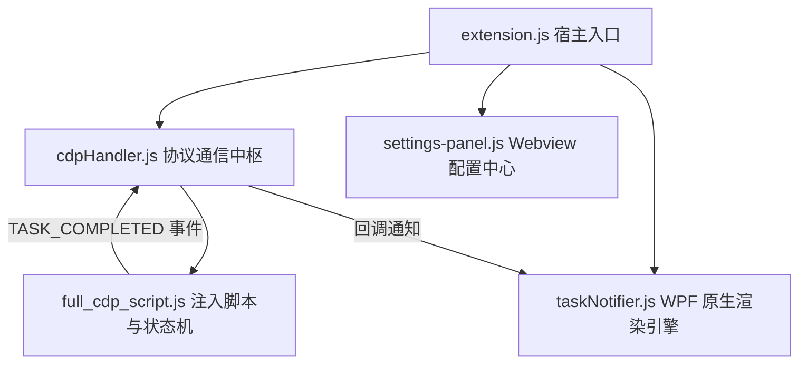

# Auto-Agent-AntiGravity 架构规则、工程边界与开发注意事项

## 1. 项目定位与核心使命
Auto-Agent-AntiGravity 是专为 Antigravity / Cursor / VS Code 生态打造的高性能 AI 辅助与自动化控制插件。
核心职责：
- **零干预自动化执行**：通过 CDP (Chrome DevTools Protocol) 协议注入，实时感知并自动确认/执行安全命令与文件应用。
- **高保真状态感知**：通过 DOM 状态机监听 AI 生成开始/结束，精准判定任务完成状态。
- **独立硬件级通知**：基于 Windows WPF / DirectX 构建高性能置顶弹窗，展示 2:1 黄金比例艺术卡片或毛玻璃 UI。

---

## 2. 核心架构与模块职责划分

1. **`extension.js`**：
   - VS Code 插件主生命周期控制器。
   - 注册状态栏、快捷命令、配置监听以及全局事件总线。
2. **`main_scripts/cdp-handler.js`**：
   - 扫描 `9000~9030` 端口的 CDP 调试实例。
   - 管理 WebSocket 连接、脚本注入以及宿主与 Webview 间双向事件中继。
3. **`main_scripts/full_cdp_script.js`**：
   - 注入到 IDE 内部的智能主循环 (`unifiedLoop`)。
   - **生成状态检测 (`checkIsGenerating`)**：多维感知 Stop 按钮、Spinners、文本增长。
   - **状态机节流**：连续 2 次确认生成中 + 3000ms 结束冷却期，杜绝假阳性误报。
4. **`main_scripts/taskNotifier.js`**：
   - 通过 `powershell.exe` 动态运行由 `taskNotifier.js` 生成的独立 WPF 窗体。
   - 严格保证 **2:1 黄金比例 (396x206)**、16px 圆角裁剪、发光边框与动态随机图片池。
5. **`main_scripts/settings-panel.js`**：
   - 现代化毛玻璃配置 Webview，支持频率调节、黑名单命令配置与通知风格切换。

---

## 3. 核心设计约束与工程边界 (Boundaries & Constraints)

### 3.1 WPF 与 XAML 渲染边界
- **XAML 属性与子标签互斥**：在 `<Border>` 等元素中，如果使用了 `<Border.Background><ImageBrush .../></Border.Background>` 子标签，**严禁在标签内同时声明 `Background="..."` 属性**，否则将导致 `XamlParseException`。
- **路径规范**：XAML 中引用的本地文件路径必须统一转为正斜杠格式（`replace(/\\/g, '/')`），避免反斜杠在不同编码与 PowerShell 作用域中发生双重转义解析异常。
- **图片尺寸严格锁定 2:1**：`media/` 下的所有海报图片分辨率均为 `2880x1440`，弹窗容器内部尺寸必须与之一致（如 `380x190`），严禁破坏比例导致被强制裁切。
- **进程用完即焚**：WPF 弹窗在用户点击或超时（8s）后必须调用 `$window.Close()`，确保 PowerShell 进程彻底退出，不留任何孤儿进程。

### 3.2 CDP 注入与状态机边界
- **免打扰与全量通知权衡**：`setOnTaskCompletedCallback` 不应对 `vscode.window.state.focused` 做死板拦截；通知防抖由 5s 节流时间戳（`cooldownMs`）控制。
- **低资源消耗保证**：
  - 严禁在注入脚本中使用 `while(true)` 无节制空转；
  - 必须使用 `MutationObserver` 响应式捕获 DOM 变动；
  - 轮询必须配合 `Web Worker` 定时器以避免 IDE 后台切屏时被 Chromium 降频挂起。

### 3.3 依赖与打包边界 (`.vscodeignore` 规范)
- **`ws` 模块必须保留**：由于 CDP 需要 WebSocket，`node_modules/ws` 及其依赖必须被打包进 VSIX。
- **打包命令必须加 `--no-dependencies`**：防止 vsce 重新触发 `npm install --production` 篡改已修整好的 node_modules 结构。
- **静态资源完整性**：打包前确认 `media/card_1.png` ~ `card_27.png` 均存在且通过打包白名单。

---

## 4. 开发与日常维护守则

1. **修改代码必须一步一验证**：
   - 涉及 `taskNotifier.js` 时，必须直接通过 Node/PowerShell 运行本地临时脚本取证弹窗是否弹出且无异常抛出。
   - 涉及 `full_cdp_script.js` 时，必须执行 `node -c` 保证语法零错误。
2. **发布与打 Tag 规范**：
   - 每次发布前递增 `package.json` 中的 `version`。
   - 确保 `vsce package` 构建出对应版本的 `.vsix` 文件。
   - 推送 `git push origin main` 及 `git push origin v*.*.*` 触发 GitHub Actions 自动化 Release 构建。
