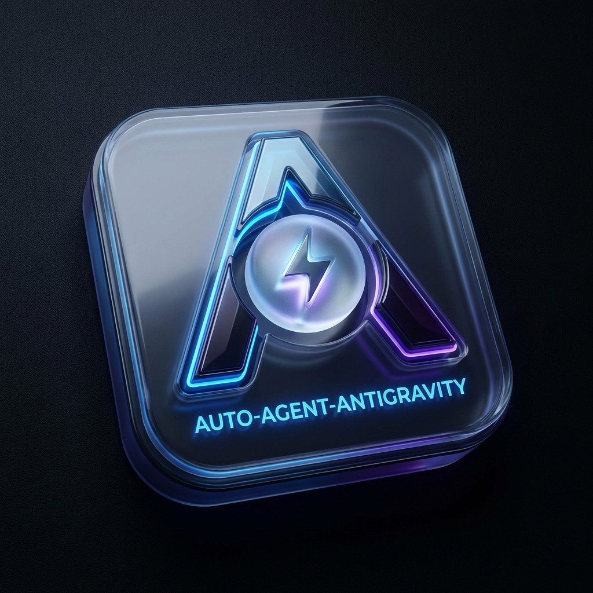

# Auto-Agent-AntiGravity

> 释放全自动 AI Agent 的潜能。实现真正的零干预开发。支持 Antigravity / Cursor / VS Code / Windsurf / Trae。

<p align="center">
  
</p>

<h1 align="center">Auto-Agent-AntiGravity</h1>

<p align="center">
  <strong>📣 释放 AI Agent 的潜能。实现真正的零干预开发与硬件级任务完成通知。</strong>
</p>

<p align="center">
  <a href="https://github.com/Huo-zai-feng-lang-li/Auto-Agent-AntiGravity/blob/master/LICENSE">
    
  </a>
  <a href="https://github.com/Huo-zai-feng-lang-li/Auto-Agent-AntiGravity">
    
  </a>
  
</p>

---

## ✨ 什么是 Auto-Agent-AntiGravity?

**Auto-Agent-AntiGravity** 是一款专为 AI 辅助编程量身定制的高性能自动化与感知扩展。它通过底层 Chrome DevTools Protocol (CDP) 注入，实时感知 AI 生成状态并自动处理确认逻辑，彻底告别频繁的“接受/确认”手动点击。同时提供基于 Windows WPF 原生渲染的 **2:1 黄金比例艺术级置顶通知**，让长任务后台执行了然于胸。

> **✅ 100% 免费开源。无任何付费门槛。全功能开放。**

---

### 🌟 Release v1.0.79 核心演进亮点

- 🎯 **双轨边沿触发状态机**：
  - 基于模型输入按钮 `Stop → Send` 状态精准捕获完成瞬间，彻底根除 MCP 工具调用中途的误报与多轮历史残留干扰。
- 🔔 **前后台智能感知与免打扰**：
  - IDE 处于前台打字与浏览时**静默不打扰**；仅在切至后台且模型彻底生成完毕后**精准弹出 1 次通知**。
- 🖼️ **原生 2:1 艺术级 WPF 弹窗**：
  - 采用 DirectX / WPF 原生硬件级渲染，呈现 2:1 黄金比例毛玻璃卡片与海报壁纸，进程用完即焚、零资源残留。
- ⚡ **单次合并选择器扫描**：
  - 重构 DOM 遍历逻辑，合并扫描路径，针对 Agent 面板定向优化，CPU 占用近乎 0.0%，彻底消除 GC 压力。
- 🛠️ **第三方启动智能自愈**：
  - 自动检测并修复快捷方式与 CDP 调试参数，无参启动时支持智能重启自愈。

---

## 🚀 核心特性矩阵

| 核心特性 | 技术实现 | 带来价值 |
| :--- | :--- | :--- |
| **自动接受代码变更** | 智能识别 `Accept all` / `Apply` / `Accept` | 秒级应用代码修改，开发无需等待确认 |
| **自动执行终端命令** | 自动触发 `Run` / `Execute` / `Confirm` | 终端指令自主执行，全流程无缝流转 |
| **双轨边沿完成通知** | 监听 `Stop → Send` 状态翻转 | 任务结束时通知，MCP 中间过程绝不误弹 |
| **前后台焦点门禁** | `vscode.window.state.focused` 联动 | 前台专注编码不被打断，后台切屏任务不漏看 |
| **WPF 黄金比例卡片** | Windows 原生 XAML + 动态海报池 | 极致视觉美感，支持点击即激活 IDE 窗口 |
| **安全黑名单拦截** | 预置命令安全过滤器与正则匹配 | 严防 `rm -rf`、`format` 等高危误操作 |
| **智能环境自愈** | 自动同步注册表与快捷方式启动参数 | 升级 IDE 或重置后自动恢复 CDP 调试支持 |

---

## 🖥️ 状态栏与操作指南

扩展集成在底部状态栏，点击即可快速切换模式：

| 图标 | 模式 | 功能说明 |
| :---: | :--- | :--- |
| `$(zap) 关闭` | **已禁用** | 暂停所有自动化点击与通知监听。 |
| `⚡ 开启` | **单标签模式** | 仅监控当前聚焦的 AI 对话与生成面板。 |
| `⚡ 多模式` | **多标签模式** | 同时监听所有 Agent 对话流（适用于多任务并发场景）。 |

### 快速使用

1. **点击状态栏图标**：在 `关闭 → 开启 → 多模式` 之间循环切换。
2. **悬停提示**：鼠标悬停在状态栏上查看连接状态、监听端口与设置入口。
3. **设置面板**：运行命令 `Auto Agent: 打开设置面板` 调出毛玻璃配置仪表盘。

---

## 🔧 快捷方式与 CDP 参数配置

插件在日常使用中支持**全自动自愈与快捷方式修复**。若需手动配置或排查，请确保 IDE 启动参数包含：

```text
--remote-debugging-port=9000
```

> **常见完整目标示例（含性能优化参数）：**
> ```text
> "D:\Antigravity\Antigravity.exe" --remote-debugging-port=9000 --disable-gpu-driver-bug-workarounds --ignore-gpu-blacklist --enable-gpu-rasterization
> ```

---

## 🛡️ 安全防御体系

自动化绝不代表盲目执行。内置安全规则引擎实时拦截危险命令：

```text
rm -rf /
rm -rf ~
rm -rf *
format c:
del /f /s /q
rd /s /q
:(){ :|:& };:
```

💡 *您随时可在配置面板中增删自定义黑名单指令。*

---

## 🌐 支持的 IDE 生态

| 开发工具 | 支持状态 | 适配方案 |
| :--- | :---: | :--- |
| ✅ **Antigravity** | **深度支持** | 专享 Agent 面板定向优化与专属 Tooltip 状态机 |
| ✅ **VS Code** | **完美支持** | 兼容通用命令与 Diff 接受流 |
| ✅ **Cursor** | **完美支持** | 适配 Composer / Chat 对话与 Apply 动作 |
| ✅ **Windsurf** | **全面支持** | 适配 Cascade 自动确认与终端执行 |
| ✅ **Trae** | **全面支持** | 适配通用 Agent 交互与代码采纳 |

---

## 📜 许可证

MIT 许可证 — 永远开源，永远免费。

<p align="center">
  用 ❤️ 为 AI 开发者社区倾力打造
</p>

